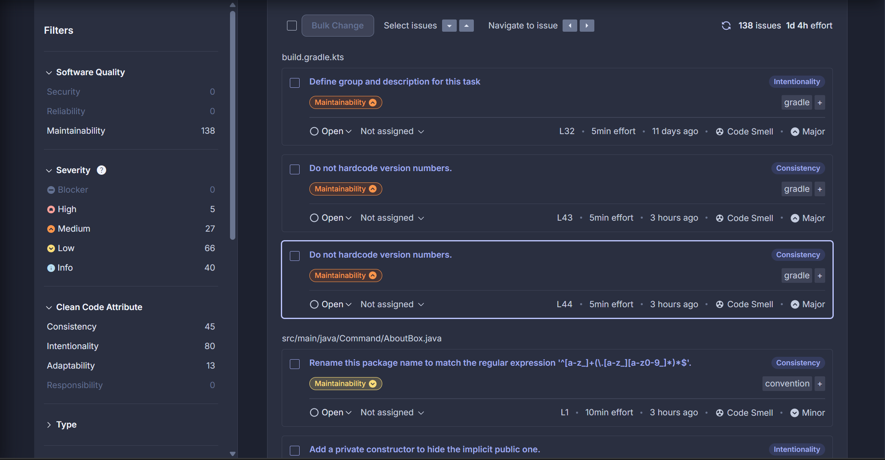
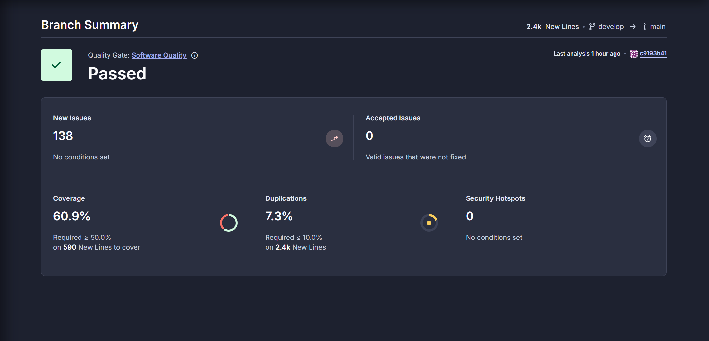

# JabberpointBramKimmy

## Project Beschrijving
Jabberpoint is een presentatie programma wat geschreven is in java icm gradle.
   De Gebruikte dependicies zijn te vinden [Build.gradle.kts](build.gradle.kts)

Dit programma is opgebouwd met diverse design patterns. Binnen dit project worden de volgende gebruikt:
   
1. Singleton
2. Observer
3. Facade
4. Command

Voor een duidelijkere toelichting waar deze patterns toegepast zijn en met welke reden, verwijzen wij naar het [Herontwerp](projectAides/Herontwerp%20systeem.pdf) & het [klassendiagram](projectAides/klassendiagram_JabberpointV2.asta).

## 🧪 CI/CD Workflow-overzicht

### ✅ onPush.yml: Voor commits naar develop
Deze workflow triggert automatisch wanneer er een push gebeurt naar de develop branch of handmatig via workflow dispatch. De pipeline is opgebouwd uit vijf jobs die in volgorde afhankelijk zijn van elkaar:

1. #### Build
    Checkt de code uit.
    
    Installeert JDK 17 (Zulu).
    
    Cachet Gradle dependencies.
    
    Bouwt het project met ./gradlew assemble.

2. #### Test
   Draait de unit tests.

    Gebruikt een virtueel display (Xvfb) voor GUI/Java tests. (Om eventuele java.awt.*.headlessExceptions te voorkomen)

3. #### Quality (SonarCloud)
   
4. Draait SonarCloud analyse via ./gradlew build sonar --info.

    Gebruikt cache voor SonarCloud en Gradle.

    Binnen Sonarcloud wordt het project volgens security & code coverage waarden getoetst en wordt er een uitbundige code analyse gedaan.

   Op Basis van deze criterea kan er een pass of fail worden gegeven voor een zogeheten "quality gate" die de CI/CD pipeline een halt kan toe roepen indien de quality gate niet gepassed wordt.
   
   
   
   

4. #### Checkstyle
   Doormiddel van de checkstyle gradle plugin wordt er volgens de NHL stenden conventies (voor zover momenteel mogelijk is) linting toegepast om de code overzichtelijk te houden.

5. #### Create Issue bij falen
   Als er iets faalt tijdens het runnen van de pipeline na een push op de development branch, wordt automatisch een GitHub issue aangemaakt met link naar de logs.

    Indien er geen errors zijn wordt deze stap geskipt

### 🔄 onPull.yml: Voor pull requests naar main
Deze workflow wordt getriggerd bij een pull request richting de main branch, mits de bronbranch develop is. Het bevat CI + release-automatisering:

1. #### Unit-test
   Draait tests (net als in onPush).

    Alleen als de head_ref van de PR develop is.

2. #### Create Jar
   Draait ./gradlew build om een JAR te maken.

    Gebruikt JDK 21 (Oracle).

    Uploadt de gegenereerde JAR als artifact.

3. #### Create Release
   Downloadt de JAR-artifact.

    Maakt een release met tijdsgebonden versie (0.1.0-yyyymmddHHMMSS).

    Uploadt de JAR als release asset op GitHub.

4. #### & 5. Foutafhandeling
   Als unit-test of create-jar faalt, wordt automatisch een comment geplaatst op de PR met uitleg.